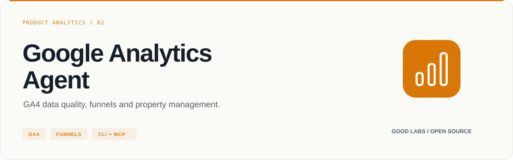
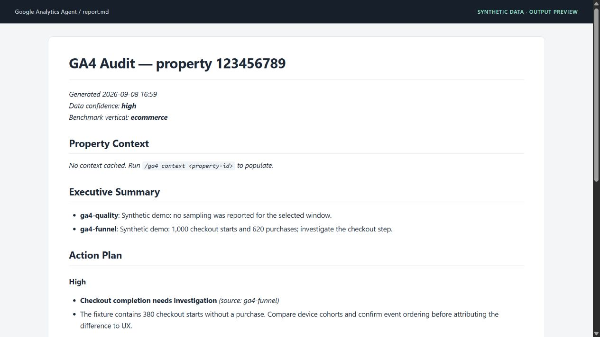

<p align="center">
  
</p>

# Google Analytics Agent

GA4 data quality, funnels and property management.

[](https://github.com/arcbaslow/google-analytics-agent/actions/workflows/tests.yml)
[](https://github.com/arcbaslow/google-analytics-agent/releases)
[](#installation)
[](LICENSE)

[Quick start](#quick-start) · [Example output](#example-output) · [Tests](#tests) · [Releases](#releases) · [Contributing](CONTRIBUTING.md)

A Python CLI and MCP server for inspecting Google Analytics 4 properties. It combines the Data and Admin APIs with website context, configurable funnels, segment comparisons and benchmark annotations, then produces a prioritized audit report.

## What you can do

| Area | Included capabilities |
| --- | --- |
| Data quality | Sampling, missing values, event coverage and confidence labels |
| Journeys | Ordered event funnels, cohort breakdowns and attribution analysis |
| Context | Website, platform and vertical inference from the property's web stream |
| Configuration | Streams, audiences, custom definitions, key events and event rules |
| Reporting | Markdown, HTML and optional PDF audits; saved report and segment definitions |
| Integration | Python adapters, `/ga4` skills and an MCP server with preview-first write tools |

## Installation

Requires **Python 3.10+**. For the source CLI:

```bash
git clone https://github.com/arcbaslow/google-analytics-agent.git
cd google-analytics-agent
python -m venv .venv
```

Activate with `source .venv/bin/activate` on macOS/Linux or `.venv\Scripts\Activate.ps1` in Windows PowerShell, then:

```bash
python -m pip install -e ".[dev]"
```

For just the published MCP package, use `python -m pip install "google-analytics-agent[mcp]"`. The **`[mcp]` extra is required** to run the server. PDF export uses the optional `[pdf]` extra and WeasyPrint system libraries; Markdown and HTML do not require them. See [setup](docs/SETUP.md).

## Quick start

Live queries require property access and Google credentials. The default path uses gcloud Application Default Credentials:

```bash
python scripts/ga4_auth.py --adc
# Run the printed gcloud command, then:
python scripts/ga4_auth.py --check
python scripts/ga4_auth.py --properties
python scripts/ga4_auth.py --quota-project YOUR_CLOUD_PROJECT_ID
```

Use a Cloud project with the Analytics Data and Admin APIs enabled. Replace the example property ID with one returned by `--properties`:

```bash
python scripts/ga4_audit.py --property 123456789 --days 28 --output audit.md
python scripts/ga4_funnel.py --property 123456789 --steps sign_up,begin_checkout,purchase --days 28 --json
```

Use any ordered event list relevant to the property. The e-commerce funnel is also available as `--preset ecomm`. A Cloud OAuth desktop-client fallback is available through `ga4_auth.py --oauth --client-secret-file client.json`.

## Example output



This is the toolkit's Markdown report rendered for documentation, with **synthetic data**. Generate it without a property or credentials:

```bash
python scripts/ga4_report.py --property 123456789 --inputs examples/demo/quality.json,examples/demo/funnel.json --format md --confidence high --vertical ecommerce --output audit.md
```

Inspect the [generated report](examples/demo/report.md) and [source fixtures](examples/demo/). The longer [sample audit](examples/sample-audit.md) is a separately authored illustration.

## MCP server

For an MCP client that supports `mcpServers` configuration:

```json
{
  "mcpServers": {
    "ga4": {
      "command": "uvx",
      "args": ["--from", "google-analytics-agent[mcp]", "ga4-mcp"]
    }
  }
}
```

Authenticate on the machine running the server before querying it. `uvx` installs the available registry version; to run the current checkout, install `.[mcp]` and set the client's command to the absolute path of `.venv/bin/ga4-mcp` (or `.venv\Scripts\ga4-mcp.exe` on Windows).

Read tools cover audits, reports, context, funnels, events, quality and property configuration. MCP write tools return a preview unless `confirm=true` is passed; review that preview before confirming. See [ga4_mcp.py](scripts/ga4_mcp.py) for the registered tools and parameter contracts.

## Everyday commands

```bash
python scripts/ga4_data.py --property 123456789 --report eventCount --dimensions eventName --days 28 --json
python scripts/ga4_events.py --property 123456789 --list-events --days 7 --json
python scripts/ga4_admin.py --property 123456789 --streams --json
python scripts/ga4_admin.py --property 123456789 --key-events --json
python scripts/ga4_definitions.py --list-segments --json
python scripts/ga4_benchmarks.py --list-verticals
```

The [router](skills/ga4/SKILL.md) provides `/ga4 audit`, `/ga4 funnel`, `/ga4 events`, `/ga4 audiences` and other agent commands. [AGENTS.md](AGENTS.md) documents the equivalent Python calls for other runtimes.

### Configuration writes

Admin writes require the appropriate property role and `analytics.edit` scope; print the sign-in command with `python scripts/ga4_auth.py --adc --write`. The agent instructions require a proposal and confirmation. Direct `ga4_admin.py` write flags execute immediately and do **not** have the MCP preview contract. Prefer the MCP workflow when you need an explicit preview step.

### Interpreting an audit

Responses use a 15-minute local cache, with supported PII patterns scrubbed by [ga4_utils.py](scripts/ga4_utils.py). Review exports before sharing them: scrubbing is not a guarantee that every identifying value has been removed.

The bundled benchmark bands cover nine verticals. They are directional estimates stored in the repository, not live market measurements. Confidence labels describe the observed data-quality conditions; they do not establish causality. The audit supports arbitrary event journeys, although the legacy HTML template still uses an e-commerce heading.

## Tests

```bash
python -m ruff check scripts/
python -m ruff format --check scripts/
python -m mypy
python -m pytest scripts/ -q --cov=scripts --cov-report=term-missing --cov-fail-under=93
```

CI runs on Python 3.10–3.13 with a **93% coverage floor**. Tests cover the CLI, audit orchestration, segments, funnels, reports, auth, MCP previews and Admin API proto round-trips using mocked transport. They need no live GA4 property. Offline integration tests do not establish that every write has been exercised against a live property. See the [release verification](docs/VERIFICATION.md).

## Repository map

| Path | Purpose |
| --- | --- |
| [scripts/](scripts/) | Data/Admin adapters, MCP server, report renderer and tests |
| [agents/](agents/) · [skills/](skills/) | Specialist analysis and `/ga4` routing |
| [examples/demo/](examples/demo/) | Synthetic report inputs and generated Markdown |
| [docs/](docs/) | Setup, releases and verification |

## Releases

**[v0.5.2](https://github.com/arcbaslow/google-analytics-agent/releases/tag/v0.5.2)** — see the [release notes](docs/RELEASE_NOTES.md) for this release and the [changelog](CHANGELOG.md) for project history.

GitHub Releases include downloadable artifacts and checksums. Package-registry publication is a separate, opt-in workflow; a GitHub release does not imply that the same version is available on PyPI or npm. Maintainers can follow the [release guide](docs/RELEASING.md).

## Contributing

Read [CONTRIBUTING.md](CONTRIBUTING.md), run the checks above, and include a minimal reproduction for bugs. Report vulnerabilities through [SECURITY.md](SECURITY.md).

## Related tools

| Project | Use it for |
| --- | --- |
| [Google Ads Agents](https://github.com/arcbaslow/google-ads-agents) | Paid media audits, tracking checks and reviewed changes. |
| [Search Console Agent](https://github.com/arcbaslow/google-search-console-agent) | Search performance, indexing and page experience. |
| [Meta Ads Agents](https://github.com/arcbaslow/meta-ads-agents) | Campaign performance, creative fatigue and event health. |
| [GTM Diff](https://github.com/arcbaslow/gtm-diff) | Review the changes in your Google Tag Manager exports. |
| [Figma Taxonomy Gen](https://github.com/arcbaslow/figma-taxonomy-gen) | Turn interactive designs into a reviewable tracking plan. |

Maintained by [Good Labs](https://goodlabs.kz) — measurement implementation, tracking plans and analytics audits.

## License

[MIT](LICENSE) © Dilshat Rakhimov. This is an independent project; it is not an official product of the platform vendors.
